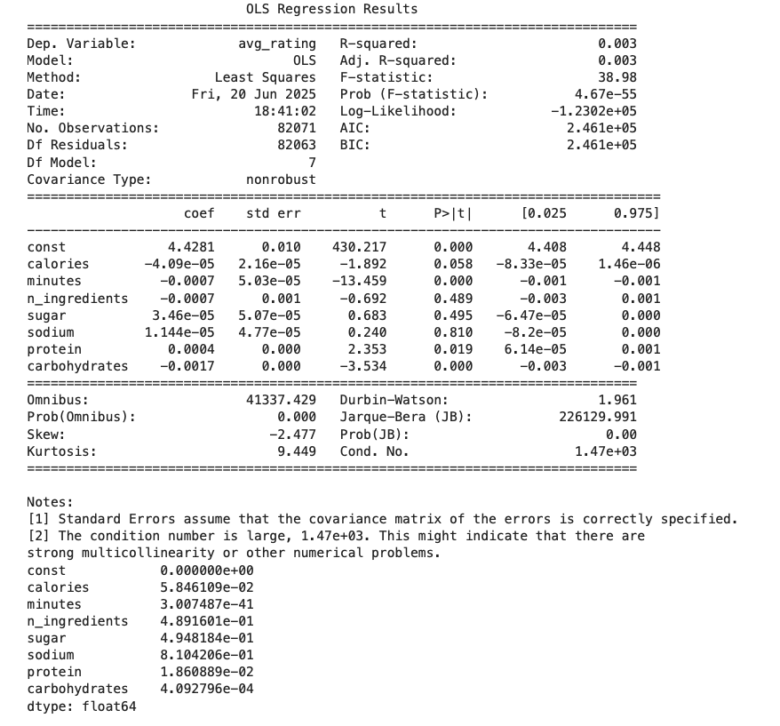

# Recipe Rating Predictor  
*EECS 398 Final Project – Jason Rong (jasonryj@umich.edu)*  

---

## Introduction  
The **Recipes & Ratings** dataset from Food.com contains ~ 80 k recipes and 700 k user ratings.  
We split each recipe’s `nutrition` array into seven numeric columns and merged the mean user rating (`avg_rating`).  

**Why study this?**  

1. **Interpretable target** – a 1-to-5 star score is intuitive for both cooks and users.  
2. **Rich feature space** – numeric nutrition, prep time, ingredient count, and text enable multi-angle analysis.  
3. **Practical value** – discovering drivers of high ratings can guide recipe ranking & health suggestions.  

### Dataset Introduction  
Each recipe provides metadata (`name`, `minutes`, `tags`), ingredient list, steps, and a `nutrition` vector (calories, fat, sugar, sodium, protein, saturated fat, carbohydrates).

Most recipes fall below 500 kcal, but a long right tail approaches 2 000 kcal – a key motivation for outlier trimming.

---

## Data Cleaning & Exploratory Data Analysis  

| Step | Action | Rationale |
|------|--------|-----------|
| ⏱ Remove *minutes* > 600 | Filter extreme cook times | > 10 h entries are likely data errors and distort averages. |
| 🥗 Keep 0 < calories ≤ 3000 | Drop invalid & ultra-high calories | Ensures realistic energy values (affects < 1 % rows). |
| 🔎 Split nutrition vector | Seven separate columns | Required for histograms, correlation, models. |
| 📊 Plot univariate / bivariate distributions | Histograms, bins, violin plots | Inspect skew, outliers & non-linear patterns. |
| 🧑‍🍳 Group by `n_ingredients` | Mean rating vs. ingredient count | Test whether “more ingredients ⇒ higher rating.” |

> **After cleaning:** **82 072 recipes (97.9 % retained).**

### Calories Distribution
<iframe src="assets/calories_cleaned.html" width="800" height="500" frameborder="0"></iframe>

> **Interpretation.** Most dishes cluster < 500 kcal; extreme high-calorie recipes are rare.  
> **Purpose.** Confirms the 0–3000 kcal filter and establishes baseline energy profile.

### Average Rating Distribution
<iframe src="assets/rating_dist.html" width="800" height="500" frameborder="0"></iframe>

> **Interpretation.** Bimodal peaks at ★4 and ★5 reveal user bias toward high ratings.  
> **Purpose.** Guides choice of RMSE (bounded, skewed target).

### Cook-Time Distribution
<iframe src="assets/cooktime_dist.html" width="800" height="500" frameborder="0"></iframe>

> **Interpretation.** Heavy right-skew; median ≈ 40 min, very few > 600 min.  
> **Purpose.** Justifies log-transform (`log_minutes`) and cook-time cap.

### Rating by Calorie Bin
<iframe src="assets/rating_by_calorie_bin.html" width="800" height="500" frameborder="0"></iframe>

> **Interpretation.** Average rating drifts downward after ~ 1000 kcal.  
> **Purpose.** Shows a mild nutrition effect and motivates tree-based models.

### Rating by Sugar Level
<iframe src="assets/rating_by_sugar.html" width="800" height="500" frameborder="0"></iframe>

> Users hardly penalize sugar within common ranges → sugar dropped from baseline.

### Rating by Sodium Level
<iframe src="assets/rating_by_sodium.html" width="800" height="500" frameborder="0"></iframe>

> Sodium shows minimal signal; confirms its low predictive value.

### Cook-Time by Rating (violin)
<iframe src="assets/violin_cook_time.html" width="800" height="500" frameborder="0"></iframe>

> High-rated recipes cluster around shorter *log-minutes* with tighter variance → minutes is predictive.

### Rating by Number of Ingredients
<iframe src="assets/average_rating_by_ingredients.html" width="800" height="500" frameborder="0"></iframe>

> Ratings plateau after ~ 10 ingredients → “more isn’t always better.”

---

## Framing a Prediction Problem  

**Prediction Problem: Regressing _Average User Rating_**

**Target:** `avg_rating` (continuous, range: 1.0 – 5.0)  
**Prediction Task Type:** Regression  

### Why this target?  
The average user rating is a direct and interpretable measure of recipe quality and user satisfaction.  
It is present in over 97 % of records after data cleaning. Predicting this value helps us understand what recipe features most impact user preferences.

### Evaluation Metric  
We will use **Root Mean Squared Error (RMSE)**. RMSE is expressed in the same units as the target (star rating) and penalises large prediction errors more than MAE, making it suitable for this task.

### Baseline Features  
Only cleaned numeric columns will be used for the baseline:

* `calories`  
* `minutes`  
* `n_ingredients`  
* Other nutrition columns (e.g., `sugar`, `sodium`, `protein`, etc.)

### Train/Test Split  
The dataset will be split **80 % for training and 20 % for testing**, using `random_state = 888` for reproducibility across baseline and final models.

### Baseline Model  
A simple pipeline using **`StandardScaler`** followed by **`LinearRegression`** provides a reference point to measure future improvements.


## Baseline Model  

### Correlation Heatmap
<iframe src="assets/corr_heatmap.html" width="800" height="600" frameborder="0"></iframe>



### Regression Feature Selection Summary

Based on the OLS regression results and VIF analysis, we recommend the following:

### ✅ Features to Keep

- **`minutes`**  
- **`protein`**  
- **`carbohydrates`**  

---

### ❌ Features to Drop

- **`calories`**  
- **`sugar`**, **`sodium`**, **`n_ingredients`**  
> 🔍 **Conclusion:**  

---

### 🧠 Modeling Logic: Baseline Linear Regression

To evaluate how simple numeric features explain recipe ratings, we constructed a baseline pipeline using standardized linear regression.

**Feature Selection**  
We chose `minutes`, `protein`, and `carbohydrates` based on:
- Low multicollinearity (VIF < 3)  
- Statistically significant coefficients (p < 0.05)  
- Strong interpretability

**Preprocessing**  
- Dropped rows with missing values in either the features or target `avg_rating`  
- Performed 80/20 train-test split with `random_state = 888` for reproducibility

**Pipeline Construction**


- Applied `StandardScaler()` to normalize numeric features  
- Trained `LinearRegression()` on the standardized data

**Evaluation**

| Dataset | RMSE   |
|---------|--------|
| Train   | 1.083  |
| Test    | 1.086  |

- Coefficient magnitudes highlight `carbohydrates` and `minutes` as most predictive  
- Residual plot showed underprediction for many 5★ recipes → points to non-linearity

> This baseline model offers a transparent starting point and shows where linear regression fails — motivating non-linear or text-enhanced models.

---

## Final Model

---

## 🧠 Modeling Logic (Feature Engineering + Random Forest)

To improve performance and model nonlinear patterns, we enhanced the numeric-only model with engineered features and a tree-based estimator.

### Feature Engineering

We introduced 2 new features:
- **`log_minutes`**: log-transformed cook time to reduce skew and variance
- **`carb_per_ing`**: carbohydrate density (carbs ÷ number of ingredients)

> These features capture prep efficiency and nutrition density — both relevant to perceived quality.

### Modeling Pipeline

We built a full pipeline:

1. **Custom Transformer**: generates `log_minutes` and `carb_per_ing`  
2. **QuantileTransformer**: maps all features to a normal distribution for robustness  
3. **RandomForestRegressor**: allows non-linear splits and captures complex feature interactions

```python
Pipeline([
  ('prep',  # Feature engineering + scaling
    Pipeline([
      ('feature_eng', RecipeFeatures()),
      ('scaler', QuantileTransformer(output_distribution='normal'))
    ])
  ),
  ('reg', RandomForestRegressor(random_state=888))
])

**Results**

| Metric | RMSE   |
|--------|--------|
| Train  | 1.053  |
| Test   | 1.087  |

> Top numeric importance: `carb_per_ing > protein > carbohydrates`  
> Lower carb density and higher protein content trend toward better user ratings

---

### 📊 TF-IDF Keyword Importance

<iframe src="assets/word_feature.html" width="800" height="600" frameborder="0"></iframe>

  


> Words like *cooking*, *great*, *cheese* align with high ratings;  
> Generic verbs (*easy*, *use*) tend to align with lower ratings.  
> → Text features clearly add explanatory power.

---

## ✅ Conclusion & Next Steps

- **Numeric nutrition alone explains limited variance** (RMSE ≈ 1)  
- **"Lower carb density + higher protein"** and moderate prep times correlate with better ratings  
- **Future work**: Integrate full ingredient/description text, image features, and test models like XGBoost or transformer-based embeddings

_Last updated: June 20, 2025_
