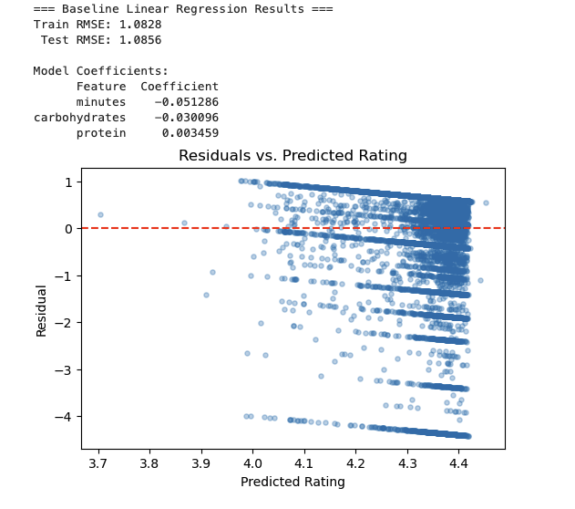
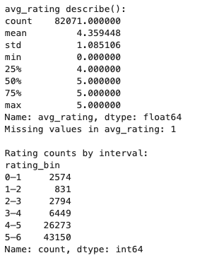
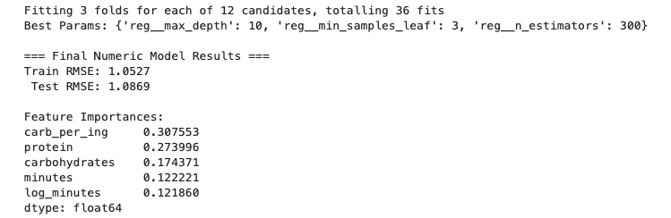

# recipe-rating-predictor
EECS 398 final project website for recipe prediction
## Data Cleaning and Exploratory Data Analysis

### Calories Distribution (Under 2000 kcal)
<iframe src="assets/calories_dist.html" width="800" height="500" frameborder="0"></iframe>

### Calories Distribution (Full)
<iframe src="assets/calories_cleaned.html" width="800" height="500" frameborder="0"></iframe>

### Average Rating Distribution
<iframe src="assets/rating_dist.html" width="800" height="500" frameborder="0"></iframe>

### Cook Time Distribution
<iframe src="assets/cooktime_dist.html" width="800" height="500" frameborder="0"></iframe>

---

### Rating by Calorie Bin
<iframe src="assets/rating_by_calorie_bin.html" width="800" height="500" frameborder="0"></iframe>

### Rating by Sugar Level
<iframe src="assets/rating_by_sugar.html" width="800" height="500" frameborder="0"></iframe>

### Rating by Sodium Level
<iframe src="assets/rating_by_sodium.html" width="800" height="500" frameborder="0"></iframe>

### Cook Time by Rating (Violin Plot)
<iframe src="assets/violin_cook_time.html" width="800" height="500" frameborder="0"></iframe>

### Rating by Number of Ingredients
<iframe src="assets/average_rating_by_ingredients.html" width="800" height="500" frameborder="0"></iframe>

---

## Baseline Model

### Feature Correlation Heatmap (Interactive)
<iframe src="assets/corr_heatmap.html" width="800" height="600" frameborder="0"></iframe>

### Feature Correlation Heatmap (Static)

### Average Rating by Group

---

## Final Model

### TF-IDF Keyword Feature Importance (Interactive)
<iframe src="assets/word_feature.html" width="800" height="600" frameborder="0"></iframe>

### TF-IDF Keyword Feature Importance (Static)

